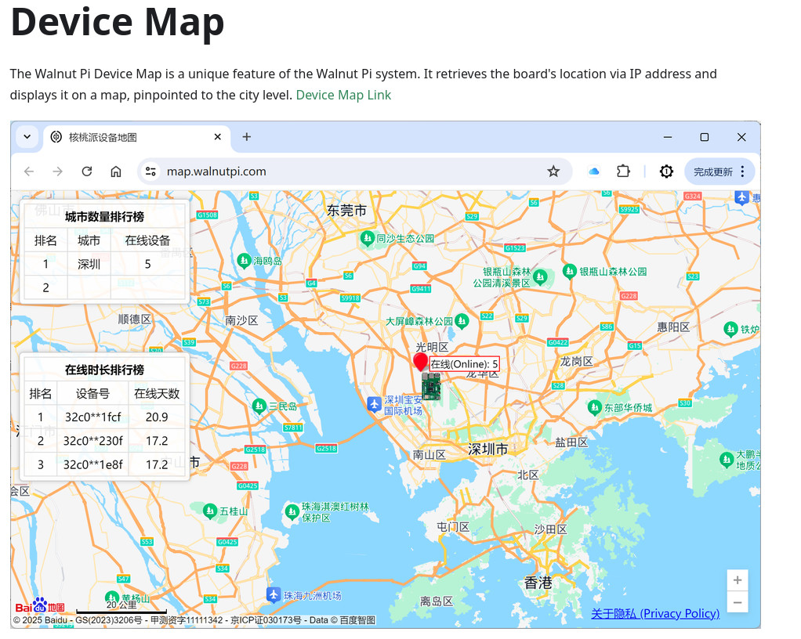
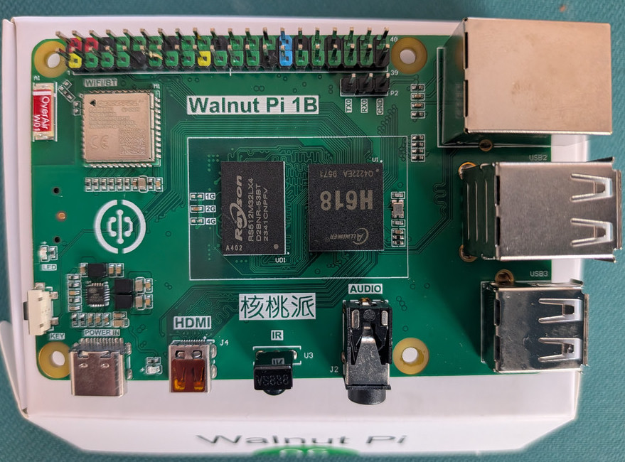
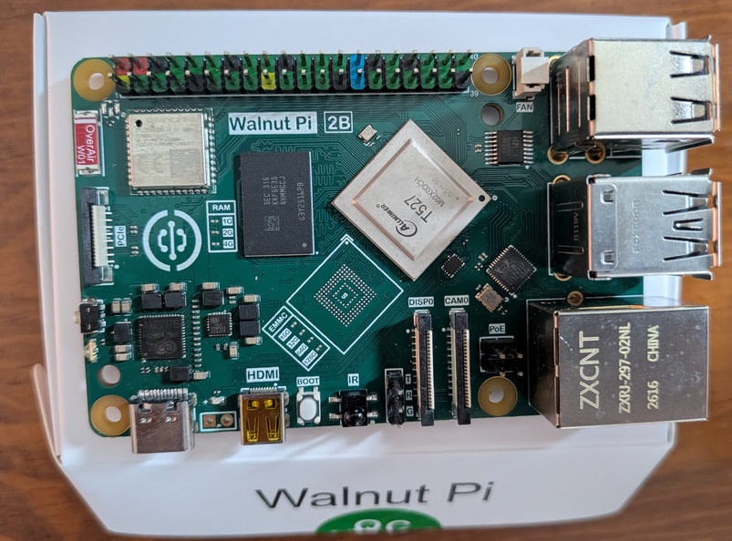
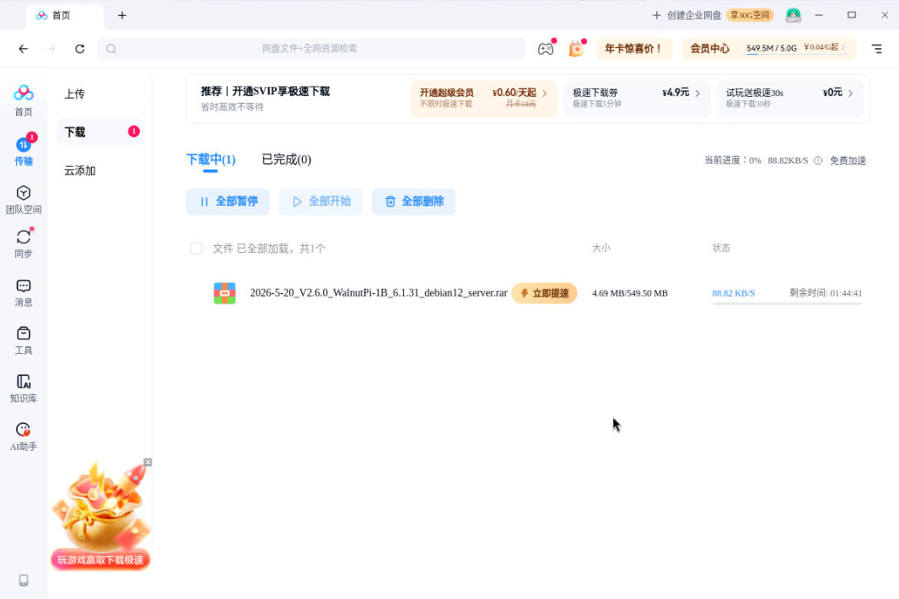
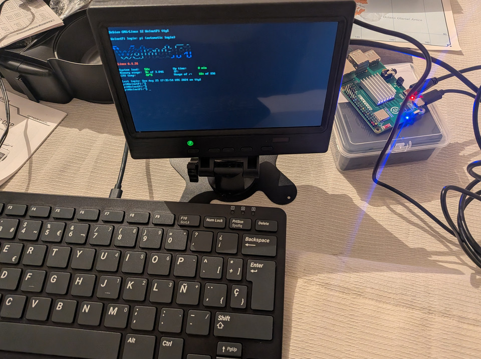
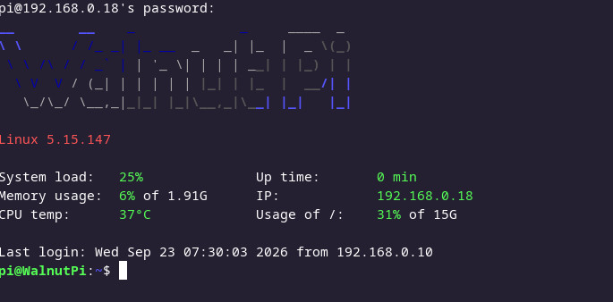
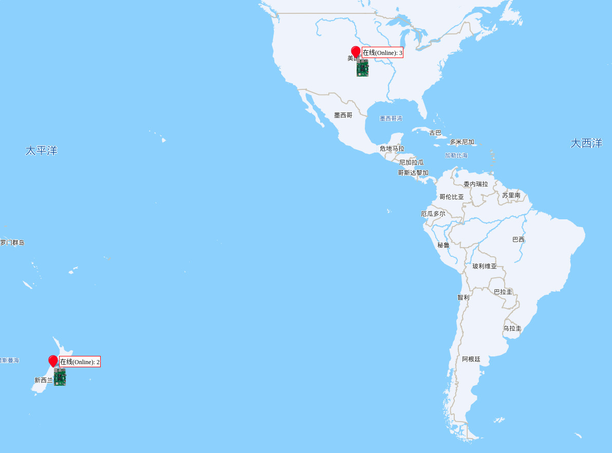

# 🥜 Walnut Pi — Device Map Telemetry

---

## 📖 Introduction

While looking for Chinese alternatives to the Raspberry Pi, I stumbled upon the **Walnut Pi** family. They caught my attention immediately: they were **cheaper** than a Raspberry Pi and, on paper, offered some **very interesting specs** — but I especially **loved the Device Map feature** documented on the project's page.

<p align="center">
  
</p>

So I decided to buy **two models** to test them hands-on:

- 🟢 **Walnut Pi 1B** — the budget-friendly entry-level option
- 🔵 **Walnut Pi 2B** — the more powerful, feature-packed version

---

<p align="center">
  
  
</p>

---

## ⬇️ Downloading the OS Images

Alright, time to get to work. From the official wiki — [https://wiki.walnutpi.com/en/docs/walnutpi_1/intro/download](https://wiki.walnutpi.com/en/docs/walnutpi_1/intro/download) — you can download the OS images that need to be flashed onto a MicroSD card.

There's a dedicated section for **users outside of China**, but I was curious and wanted to try the procedure for downloading directly from **Baidu** (the "Chinese Google").

To my surprise, **my Mexican phone number was accepted** for registration — no region blocks, no workarounds needed. 

After that, I installed the **Baidu Netdisk client** on my **Arch Linux** machine, and from there I downloaded the images. The transfer took **longer than expected**, but it completed without any issues.

<p align="center">
  
</p>

---

## 💾 Flashing the Image

Once the images are downloaded, all that's left is to flash them. On Linux, I did it with `dd`:

```bash
dd if=2026-2-2_V1.7.0_WalnutPi-2B_5.15.147_debian12_server.img of=/dev/sdb bs=4M status=progress
```

And that's it — the next step is booting up. 🚀

---

## 🚀 First Boot

<p align="center">
  
</p>

The Walnut Pi booted up without issues. I configured the WiFi network as instructed in the wiki:

```bash
nmcli dev wifi
sudo nmcli dev wifi connect XXXXX password XXXXX
```

And just like that, it connected without any problems. After that, I could connect via **SSH** to take a look at the system.

<p align="center">
  
</p>

### 🖥️ System Info

```
Linux WalnutPi 5.15.147 #15 SMP PREEMPT Mon Jul 20 17:26:29 CST 2026 aarch64 GNU/Linux
```

### 🔄 System Update Check

```bash
root@WalnutPi:~# wpi-update

    Your system version is already up to [1.8.0], No need to update
root@WalnutPi:~#
```

---

## 🗺️ Device Map

This is a really nice feature on the Walnut Pi boards. It places a **walnut icon on your country** on a world map, and also tracks the **uptime** of your device. I was really excited to see my board appear in **Mexico**… however, it seems the backend is **geoblocked**, and all devices from Mexico get grouped into the **USA** zone. 😞

But let's rewind a bit and try to understand how this neat feature actually works. 

### 🔧 The Telemetry Service

The service that sends telemetry data to paint the map is called `map_device`. is running by default as documented:

```bash
root@WalnutPi:~# systemctl status map_device
● map_device.service - map device
     Loaded: loaded (/lib/systemd/system/map_device.service; enabled; preset: e>
     Active: activating (start) since Wed 2026-09-09 17:28:59 CST; 23min ago
   Main PID: 1157 (map_device)
      Tasks: 4 (limit: 2226)
     Memory: 29.1M
        CPU: 788ms
     CGroup: /system.slice/map_device.service
             ├─1157 /usr/lib/walnutpi/service/map_device
             └─1180 /usr/lib/walnutpi/service/map_device

Sep 09 17:28:59 WalnutPi systemd[1]: Starting map_device.service - map device...
```

### 📡 What Gets Sent to China

When run manually, the service sends this data:

```bash
root@WalnutPi:~# /usr/lib/walnutpi/service/map_device
核桃派1代
Sent: {"chip_platform": "H618", "chip_id": "33802000ac00480801081365308f24d2", "os_version": "2.6.0", "os_type": "server"}
```

With this, the backend generates the metrics — and I assume it also grabs the **public IP** and geolocates it on the server side.

### 🔍 Deeper Analysis of the Flow

Taking a closer look at how the metric works, the flow goes roughly like this:

```
map_device
    │
    └── Embedded Python
          │
          └── wpi_client.py
                 │
                 ├── chip_info_get()
                 │      │
                 │      ├── /sys/class/sunxi_info/sys_info
                 │      ├── /etc/WalnutPi-release
                 │      └── returns:
                 │           H618
                 │           <chipid>
                 │           2.6.0
                 │           server
                 │
                 ├── json.dumps(chip_info)
                 │
                 └── thread → send_message()
                              │
                              ├── TCP
                              │
                              ├── map.walnutpi.com:10240
                              │
                              ├── sendall(JSON)
                              │
                              └── sleep(300)
```

Although the client is a Python binary that was converted into an executable (so the code can't be read directly), I was able to **recreate its functionality almost entirely**. Here's what it does:

```python
"""
Walnut Pi Device Map terminal client code
Description: Periodically sends its own chip model and chipid to the server.
"""

import socket
import threading
import time
import os
import re
import json


def chip_info_get():
    chip_platform = None
    chip_id = None
    os_version = None
    os_type = None

    chip_platform = os.popen(
        'cat /sys/class/sunxi_info/sys_info | grep "platform"'
    ).readline()

    if 'h616' in chip_platform:
        print('Walnut Pi Gen 1')
        chip_platform = 'H618'

        id_get = os.popen(
            'cat /sys/class/sunxi_info/sys_info | grep "chipid"'
        ).readline()

        match = re.search(
            r'sunxi_chipid\s*:\s*([a-f0-9]+)',
            id_get
        )

        if match:
            chip_id = match.group(1)
        else:
            print('No chip_id found')

        os_version_get = os.popen(
            'cat /etc/WalnutPi-release | grep "version="'
        ).readline()

        match = re.search(
            r'version=(.*)',
            os_version_get
        )

        if match:
            os_version = match.group(1)
        else:
            print('No os version found')

        os_type_get = os.popen(
            'cat /etc/WalnutPi-release | grep "os_type="'
        ).readline()

        match = re.search(
            r'os_type=(.*)',
            os_type_get
        )

        if match:
            os_type = match.group(1)
        else:
            print('No os type found')

    elif 'T527' in chip_platform:
        print('Walnut Pi Gen 2')
        chip_platform = 'T527'

        id_get = os.popen(
            'cat /sys/class/sunxi_info/sys_info | grep "serial"'
        ).readline()

        match = re.search(
            r'sunxi_serial\s*:\s*([a-f0-9]+)',
            id_get
        )

        if match:
            chip_id = match.group(1)
        else:
            print('No chip_id found')

        os_version_get = os.popen(
            'cat /etc/WalnutPi-release | grep "version="'
        ).readline()

        match = re.search(
            r'version=(.*)',
            os_version_get
        )

        if match:
            os_version = match.group(1)
        else:
            print('No os version found')

        os_type_get = os.popen(
            'cat /etc/WalnutPi-release | grep "os_type="'
        ).readline()

        match = re.search(
            r'os_type=(.*)',
            os_type_get
        )

        if match:
            os_type = match.group(1)
        else:
            print('No os type found')

    return chip_platform, chip_id, os_version, os_type


SERVER_IP = 'map.walnutpi.com'
SERVER_PORT = 10240

chip_id = None

while chip_id is None:
    try:
        (
            chip_platform,
            chip_id,
            os_version,
            os_type
        ) = chip_info_get()

    except Exception as e:
        print(f'chip_info_get error: {e}')
        time.sleep(1)

chip_info = {
    'chip_platform': chip_platform,
    'chip_id': chip_id,
    'os_version': os_version,
    'os_type': os_type
}

chip_info_str = json.dumps(chip_info)


def send_message():
    while True:
        try:
            with socket.socket(
                socket.AF_INET,
                socket.SOCK_STREAM
            ) as s:

                s.connect((SERVER_IP, SERVER_PORT))

                s.sendall(
                    chip_info_str.encode('utf-8')
                )

                print(f'Sent: {chip_info_str}')

        except ConnectionRefusedError:
            print(
                'Connection refused. Server might not be running '
                'or IP/Port is incorrect.'
            )

        except Exception as e:
            print(f'An error occurred: {e}')

        time.sleep(300)


thread = threading.Thread(
    target=send_message
)

thread.daemon = True
thread.start()


try:
    while True:
        time.sleep(1)

except KeyboardInterrupt:
    print('Stopped by the user.')
```

---

## 🌐 Imagining How the Backend Works

With the information we have — the client code, the service behavior, the JSON payload, and a network capture — we can reverse-engineer what the Chinese backend does and how it generates the map.

The flow would look like this:

```
wpi_client.pyc
     │
     │ TCP :10240
     │
     ▼
106.52.98.85
     │
     │ storage / processing
     ▼
api.walnutpi.com
     ├── /data
     ├── /city_rank
     └── /time_rank
          │
          ▼
     map.walnutpi.com
```

### 📡 Network Capture (Wireshark / tcpdump)

Here's the actual packet capture showing the client sending its telemetry to `106.52.98.85:10240`:

```
18:08:15.189967 IP 192.168.0.24.33380 > 106.52.98.85.10240: Flags [S], seq 2399582240, win 64240, options [mss 1460,sackOK,TS val 3857131722 ecr 0,nop,wscale 7], length 0
18:08:15.422450 IP 106.52.98.85.10240 > 192.168.0.24.33380: Flags [S.], seq 2966755180, ack 2399582241, win 65160, options [mss 1424,sackOK,TS val 1694501674 ecr 3857131722,nop,wscale 7], length 0
18:08:15.422541 IP 192.168.0.24.33380 > 106.52.98.85.10240: Flags [.], ack 1, win 502, options [nop,nop,TS val 3857131955 ecr 1694501674], length 0
18:08:15.422676 IP 192.168.0.24.33380 > 106.52.98.85.10240: Flags [P.], seq 1:117, ack 1, win 502, options [nop,nop,TS val 3857131955 ecr 1694501674], length 116
18:08:15.422875 IP 192.168.0.24.33380 > 106.52.98.85.10240: Flags [F.], seq 117, ack 1, win 502, options [nop,nop,TS val 3857131955 ecr 1694501674], length 0
18:08:15.651445 IP 106.52.98.85.10240 > 192.168.0.24.33380: Flags [.], ack 117, win 509, options [nop,nop,TS val 1694501908 ecr 3857131955], length 0
18:08:15.699267 IP 106.52.98.85.10240 > 192.168.0.24.33380: Flags [.], ack 118, win 509, options [nop,nop,TS val 1694501957 ecr 3857131955], length 0
18:08:16.737337 IP 106.52.98.85.10240 > 192.168.0.24.33380: Flags [F.], seq 1, ack 118, win 509, options [nop,nop,TS val 1694502904 ecr 3857131955], length 0
18:08:16.737391 IP 192.168.0.24.33380 > 106.52.98.85.10240: Flags [.], ack 2, win 502, options [nop,nop,TS val 3857133270 ecr 1694502904], length 0
```

And the decoded payload (the JSON we already know):

```
{"chip_platform": "H618", "chip_id": "33802000ac00480801081365308f24d2", "os_version": "2.6.0", "os_type": "server"}
```

### 🧩 Decoding the Server-Side Logic

Looking at the flow, the backend most likely does the following:

1. **Accepts the TCP connection** on port `10240`.
2. **Parses the JSON payload** to extract `chip_platform`, `chip_id`, `os_version`, and `os_type`.
3. **Logs the source IP** of the connection (which is the **public IP** of the client, as seen by the server).
4. **Geolocates the IP** using an IP-to-country/city database.
5. **Stores the record** in a database (probably tied to `/data` on `api.walnutpi.com`).
6. **Aggregates the data** into rankings:
   - `/city_rank` — ranking by city
   - `/time_rank` — ranking by uptime
7. **Serves the aggregated data** to `map.walnutpi.com`, which renders the walnut icons on the world map.


---

### ❓ The Problem: Why Doesn't My Walnut Pi Register in Mexico?

At this point, there are two main hypotheses:

1. **The backend isn't receiving the client data correctly** — the JSON payload gets lost or malformed along the way.
2. **The geolocation step is wrong** — boards with Mexican IPs are not being counted in the correct country (probably bucketed into the USA zone).

To confirm or rule out the first hypothesis, I decided to **set up a VPN** and re-route the telemetry traffic through a different country. If the board showed up in the new country, the client was fine — and the problem was definitely on the **geolocation** side.

### 🛡️ Setting Up a VPN on the Walnut Pi

I chose **Mullvad VPN** with **WireGuard**, since it's fast, lightweight, and easy to configure.

Because the Walnut Pi kernel is **modified by the manufacturer**, using the standard kernel WireGuard module wasn't straightforward — so I went with the **Go userspace implementation** (`wireguard-go`), which works independently of the kernel.

Installation was simple:

```bash
apt update && apt install wireguard-tools golang -y
go install golang.zx2c4.com/wireguard@latest
apt install wireguard-go -y
```

### 📝 WireGuard Config

Here's the Mullvad WireGuard config:

```ini
root@WalnutPi:~# cat /etc/wireguard/mex.conf
[Interface]
# Device: Witty Bull
PrivateKey = XXXXXXX
Address = XXXX/32
DNS = XXXXX

[Peer]
PublicKey = XXXXX
AllowedIPs = 0.0.0.0/0
Endpoint = XXXX:51820
```

### ⚙️ Startup Script

Since `wireguard-go` runs in userspace, I had to write a small helper script to bring up the interface, assign the IP, set the MTU, and route everything through the tunnel:

```bash
root@WalnutPi:~# cat /root/start-vpn.sh
#!/bin/bash
sysctl -w net.ipv6.conf.all.disable_ipv6=1 >/dev/null
sysctl -w net.ipv6.conf.default.disable_ipv6=1 >/dev/null
wireguard-go mex &
sleep 1
grep -vE '^(Address|DNS)' /etc/wireguard/mex.conf > /tmp/mex_clean.conf
wg setconf mex /tmp/mex_clean.conf
ip address add XXXXX/32 dev mex 2>/dev/null || true
ip link set mtu 1420 up dev mex
GATEWAY=$(ip route show default | awk 'NR==1 {print $3}')
ip route add XXXXXX via $GATEWAY 2>/dev/null || true
ip route add default dev mex 2>/dev/null || ip route replace default dev mex
echo "nameserver XXXXX" > /etc/resolv.conf
echo "¡VPN iniciada correctamente!"
```

### 🔄 Systemd Service

To make the VPN start automatically on boot, I wrapped the script into a systemd service:

```ini
root@WalnutPi:~# cat /etc/systemd/system/wireguard-mex.service
[Unit]
Description=WireGuard VPN (mex) via userspace
After=network.target network-online.target
Wants=network-online.target

[Service]
Type=oneshot
RemainAfterExit=yes
ExecStart=/root/start-vpn.sh
ExecStop=/ip link delete mex
TimeoutStartSec=0

[Install]
WantedBy=multi-user.target
```

Then enabled it:

```bash
systemctl daemon-reload
systemctl enable wireguard-mex.service
systemctl start wireguard-mex.service
systemctl status wireguard-mex.service
```

### 🧪 The Experiment: Switching to New Zealand

Once the VPN was up, I switched the endpoint to **New Zealand**, rebooted the Walnut Pi, and waited a few minutes.

**Boom.** The **New Zealand counter on the map went from 1 to 2.** 🎉

<p align="center">
  
</p>

### 🇲🇽 The Mexico Test: Are Mexican Boards Being Counted as USA?

With the VPN experiment as proof that the map marker follows the **public IP** of the board, the next question is obvious:

> **What happens with Mexico?** Are Mexican Walnut Pi boards being silently counted in the **USA** zone?

To confirm this, I wrote a small **Bash script** that polls the Walnut Pi map API every **30 seconds** and extracts the **USA count** using a **bounding box** for the continental United States:

- Latitude: `24` to `50`
- Longitude: `-125` to `-66`

Here's the script:

```bash
#!/bin/bash

API_URL="https://api.walnutpi.com/data"
INTERVAL=30
prev_usa=0

while true; do
    now=$(date '+%Y-%m-%d %H:%M:%S')
    data=$(curl -s "$API_URL")

    usa=$(jq '[.[] | select(
        .lat >= 24 and .lat <= 50 and
        .lng >= -125 and .lng <= -66
    ) | .count] | add // 0' <<< "$data")

    printf '%s  USA=%s\n' "$now" "$usa"

    if [ "$prev_usa" -ne 0 ] && [ "$usa" -gt "$prev_usa" ]; then
        echo "[$now] >>> USA: $prev_usa -> $usa"
    fi

    prev_usa=$usa
    sleep "$INTERVAL"
done
```

### 🔍 What the Script Does

1. **Fetches the live data** from `https://api.walnutpi.com/data` — the same endpoint that `map.walnutpi.com` uses to render the map.
2. **Filters all entries** whose `lat`/`lng` fall inside the continental USA bounding box.
3. **Sums up the counts** and prints the total, with a timestamp.
4. **Alerts** whenever the USA count increases compared to the previous poll.

### 🧪 The Experiment

With the script running, I booted up **my two Walnut Pi boards** — both connected from **Mexico**, both without any VPN.

And then I waited. 👀

